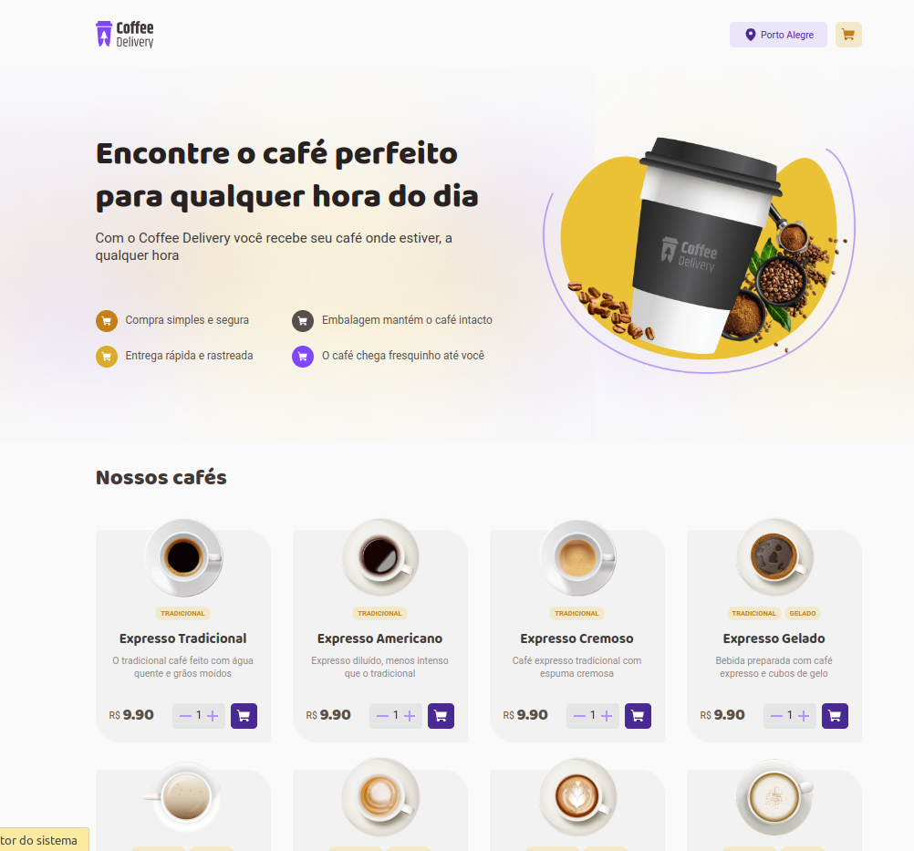
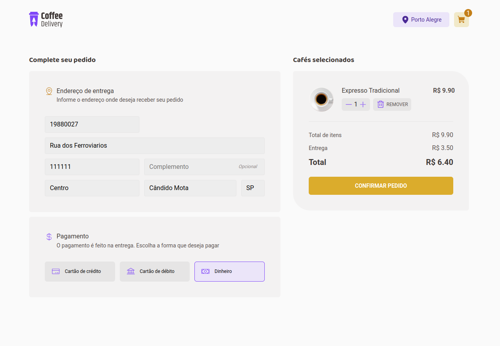
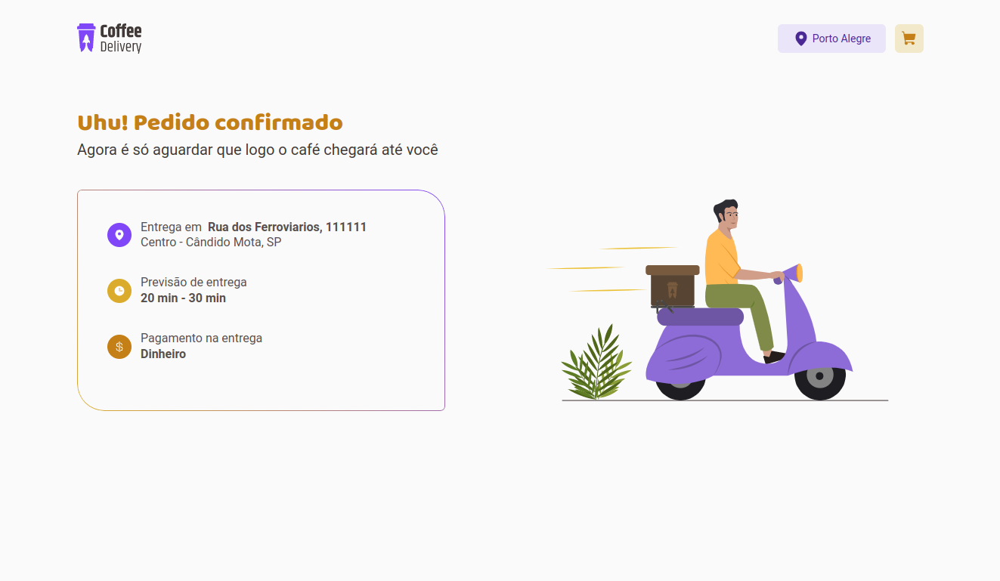

# Desafio - Coffe Delivery - ignite

Desafio "Desafio 02 - Desafio: Coffee Delivery"
proposto pelo curso Ignite da RocketSeat, na trilha de React.JS

## Propósito

O propósito do desafio é implementar uma aplicação simples a partir de um protótipo, que contém os seguintes conceitos:
- Rotas
- ContextAPI
- Styled Components

## Demonstração

